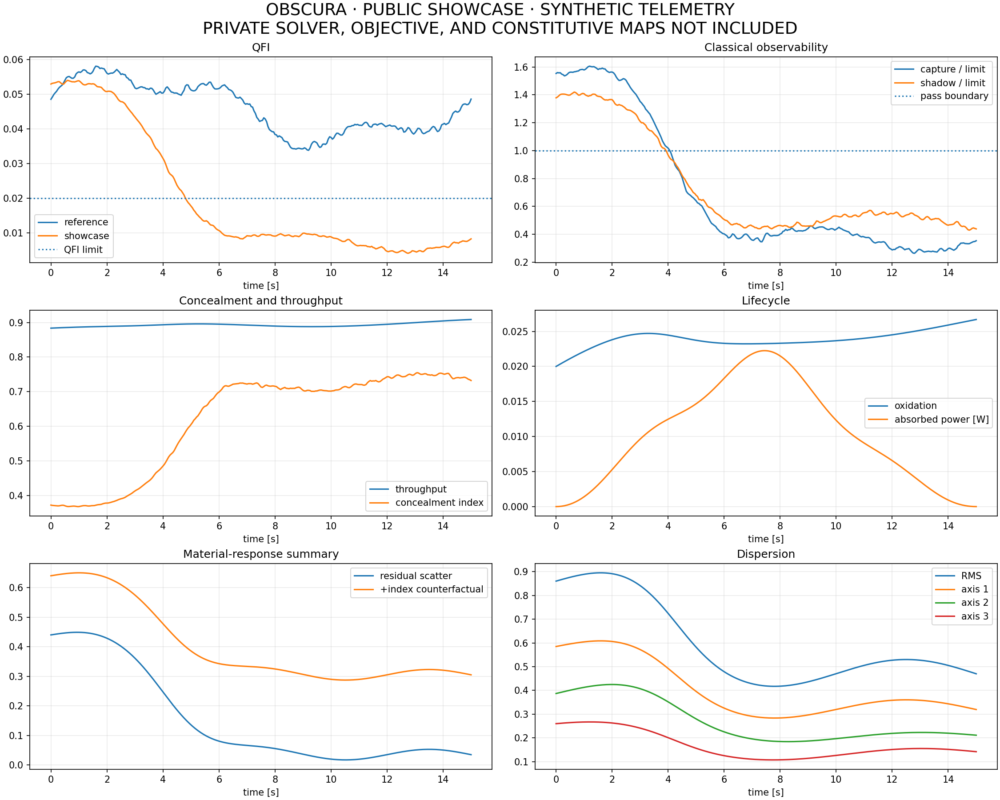
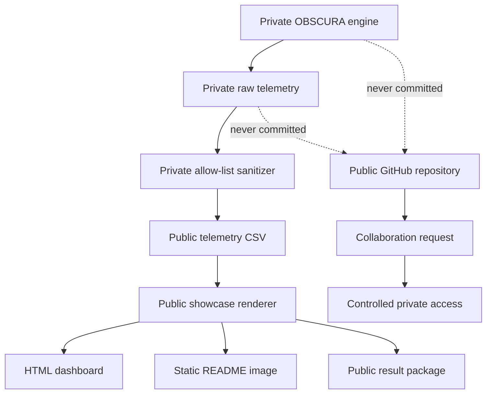

# OBSCURA: A Programmable Metamaterial Dual-Observability Lab

Observability Benchmark for Simulated Cloaking Under Reduced-order Adaptation

**Tagline:** Simulated cloaking benchmark, not experimental invisibility.


<p align="center">
  
</p>

## Project description

OBSCURA is a reduced-order, time-dependent programmable-metamaterial control benchmark that studies simultaneous suppression of classical detector observability and quantum parameter sensitivity under explicit spectral, energy, lifecycle, and channel constraints.

A scientifically careful public description is:

OBSCURA is a time-dependent adaptive-control simulation that suppresses classical capture and shadow observability while reducing per-probe quantum Fisher information below configured thresholds, producing simulated dual-observability concealment within the declared model.

The required qualifier is equally important:

OBSCURA is a reduced-order feasibility benchmark, not an experimental or universal demonstration of electromagnetic invisibility.

The phrase dual observability refers to two model families:

- Classical observability: noise-aware capture and shadow signatures.
- Quantum parameter observability: quantum Fisher information, or QFI, for a declared phase-like parameter in a finite reduced channel.

Low QFI does not mean that every possible quantum detector fails. It means the selected encoded parameter is difficult to estimate from the modeled output state. This distinction is foundational, not decorative.

## Why the public repository is deliberately limited

A public GitHub repository is excellent for visibility, critique, and finding collaborators. It is a poor vault. A shortened copy of a 50,000-line research engine can still expose architecture, objective structure, calibration logic, and enough relationships to reconstruct the important parts.

This repository therefore publishes the presentation plane, not the invention plane.

| Public showcase | Private engine |
| --- | --- |
| Synthetic or sanitized telemetry | Full state and raw telemetry |
| Plot builders and dashboard vocabulary | Complete simulation and control loop |
| General scientific equations | Exact constitutive mappings and calibration |
| Declared threshold semantics | Exact objective weights and guard logic |
| Read-only result schema | SPSA moments, probes, rescue rules, and schedules |
| Collaboration pathway | Full notebook, API stack, credentials, and prompts |

The public code is useful for reviewing the scientific story, exploring the metric relationships, and rendering approved result summaries. It is intentionally insufficient for reproducing the private solver.

## Repository architecture



A real private run should cross the public boundary only through an explicit, reviewed allow-list. Extra columns are rejected rather than silently ignored.

## Quick start

### 1. Clone and create an environment

```bash
git clone https://github.com/csalnav2/obscura-metamaterial-observability-lab.git
cd obscura-metamaterial-observability-lab

python -m venv .venv
```

Activate the environment:

```powershell
# Windows PowerShell
.venv\Scripts\Activate.ps1
```

```bash
# macOS or Linux
source .venv/bin/activate
```

### 2. Install the public showcase dependencies

```bash
python -m pip install --upgrade pip
pip install -r requirements.txt
```

### 3. Generate the synthetic public dashboard

```bash
python obscura_showcase.py --output-dir public_output
```

Generated artifacts:

```text
public_output/
├── obscura_public_showcase.html
├── obscura_public_overview.png
├── public_metadata.json
└── public_telemetry.csv
```

Open `public_output/obscura_public_showcase.html` in a browser.

### 4. Validate the public release boundary

```bash
python scripts/audit_public_release.py .
pytest
```

The audit fails when it detects private artifact hashes, oversized notebook cells, core private implementation identifiers, credentials, private keys, or magic-access URLs.

## Public threshold convention

The currently declared public boundaries are

```math
F_Q \leq 0.020, \qquad C \leq 0.020, \qquad S \leq 0.080,
```

where

- $F_Q$ is per-probe QFI for the selected modeled parameter,
- $C$ is the noise-aware capture ratio,
- $S$ is the shadow error.

Define the threshold-normalized classical severity

```math
O_C(t)=\max\left[\frac{C(t)}{C_{\mathrm{lim}}},\frac{S(t)}{S_{\mathrm{lim}}}\right].
```

The public classical pass boundary is therefore

```math
O_C(t)\leq 1.
```

A sampled robust assessment is conceptually stricter:

```math
\max_{\lambda\in\Lambda}F_Q(\lambda)\leq F_{Q,\mathrm{lim}},
```

```math
\max_{\lambda\in\Lambda}C(\lambda)\leq C_{\mathrm{lim}},\qquad\max_{\lambda\in\Lambda}S(\lambda)\leq S_{\mathrm{lim}},
```

with additional scattering, absorption, material-validity, throughput, and applicable wave/channel gates.

> [!NOTE]
> Passing a finite sampled set $\Lambda$ is evidence only for that declared set. It is not a proof over every wavelength, direction, polarization, mode, detector, material specimen, or perturbation.

## Dashboard guide and mathematics

The private dashboard contains eleven primary scientific views plus additional wave and wavelength audits. The public showcase preserves their vocabulary and interpretation while replacing the enabling engine with synthetic or sanitized inputs.

### Plot 1: Optimizer comparison

#### What it displays

The comparison contains three stacked panels:

- QFI per detected probe.
- Classical capture and shadow observability.
- Composite concealment and throughput.

The decisive QFI is conservatively summarized as

```math
F_Q^{\star}(t)=\max\left[F_Q^{\mathrm{measured}}(t),\max_{\lambda\in\Lambda}F_Q(t,\lambda)\right].
```

A good controlled run should show all of the following:

- $F_Q^{\star}$ remains below its declared boundary.
- Capture and shadow remain below their normalized boundary.
- Throughput does not collapse.
- Absorption does not become the hidden mechanism of apparent concealment.
- Improvement persists over time rather than appearing at one favorable sample.

Display smoothing may be used only for causal presentation. Raw exported values must remain unchanged, and visual filtering must never be presented as physical evidence.

#### What is withheld

The public repository does not publish the complete private objective, coefficient weights, candidate horizon, guard thresholds, coordinate-rescue logic, or optimizer state.

### Plot 2: Degradation and lifecycle

#### What it displays

- Oxidation or bounded damage state.
- Scattering and absorption stress.
- Incident, intercepted, absorbed, nonlinear, and healing power.
- Damage formation, net rate, accumulated dose, and healing expenditure.

A general bounded formation-healing model is

```math
\frac{dD}{dt}=k_f(1-D)-k_hD,
```

with

```math
k_f=k_{\mathrm{photo}}+k_{\mathrm{environment}}.
```

For rates held constant over one step $\Delta t$, the exact update is

```math
D_{n+1}=D_{\infty}+\left(D_n-D_{\infty}\right)\exp\left[-(k_f+k_h)\Delta t\right],
```

where

```math
D_{\infty}=\frac{k_f}{k_f+k_h}.
```

A bounded healing actuator can be assigned a quadratic energetic cost,

```math
P_h=P_{h,\max}u_h^2,\qquad 0\leq u_h\leq 1.
```

A low-observability state is scientifically weak when it requires rapidly increasing damage, excessive healing power, rising absorption, or survives for only a negligible interval.

The private rate constants are accelerated surrogate parameters unless fitted to a specific specimen. They are not public lifetime predictions.

### Plot 3: Photon scene

#### What it displays

- The programmable outer cube.
- The solid inscribed focus cube.
- A downstream observer representation.
- Incident, internal, scattered, and post-exit packets.
- Geometric observer-coverage vectors.

The visible packets are display particles. They do not resolve optical carrier oscillations and do not travel at the physical speed of light.

For a signed-index ray surrogate, let $\mathbf{i}$ be a normalized incident direction and $\mathbf{n}$ the interface normal pointing toward the incident medium. The incident tangential component is

```math
\mathbf{t}_i=\mathbf{i}+\cos\theta_i\,\mathbf{n},\qquad\cos\theta_i=-\mathbf{i}\cdot\mathbf{n}.
```

A signed transmitted tangential component is

```math
\mathbf{t}_t=\frac{n_1}{n_2}\mathbf{t}_i.
```

Define

```math
k=1-\lVert\mathbf{t}_t\rVert^2.
```

For $k\geq 0$, a transmitted direction can be written

```math
\mathbf{d}_t=\mathbf{t}_t-\sqrt{k}\,\mathbf{n}.
```

For $k<0$, the reduced ray model returns a reflected branch. A negative $n_2$ reverses the tangential sign in this surrogate, representing negative refraction. This remains a ray-level approximation, not a solution of full Maxwell boundary conditions.

### Plot 4: Rank-3 tensor lattice or tensor slices

#### What it displays

The plot represents all 27 components of an effective coupling tensor

```math
T_{ijk}, \qquad i,j,k\in\{x,y,z\}.
```

It may appear as a three-dimensional coefficient lattice or three heatmap slices for $k=x,y,z$.

Under a body-to-world rotation $R$, a rank-3 tensor transforms as

```math
T^{\mathrm{world}}_{ijk}=\sum_{a,b,c}R_{ia}R_{jb}R_{kc}T^{\mathrm{body}}_{abc}.
```

The Frobenius norm is

```math
\lVert T\rVert_F=\sqrt{\sum_{i,j,k}T_{ijk}^2}.
```

A directional contraction is

```math
(\mathbf{v}_T)_i=\sum_{j,k}T_{ijk}d_jd_k,
```

or compactly

```math
\mathbf{v}_T=T:\mathbf{d}\otimes\mathbf{d}.
```

The object is an effective dimensionless coupling tensor. It is not a retrieved experimental susceptibility tensor.

### Plot 5: Photon flag-complex topology

#### What it displays

- A finite sample of packet positions.
- Mutual-nearest-neighbor edges.
- Filled triangular 2-simplices.
- Betti numbers $\beta_0$ and $\beta_1$ at one spatial scale $\epsilon$.

An edge $(i,j)$ is retained when the points are mutual neighbors and

```math
d_{ij}\leq\epsilon.
```

A triangle is added when all three pairwise edges exist. For the resulting finite clique complex,

```math
\beta_0=\text{number of connected components},
```

and

```math
\beta_1=|E|-|V|+\beta_0-\operatorname{rank}_{\mathbb{F}_2}(\partial_2).
```

Interpretation:

- Larger $\beta_0$ indicates more disconnected packet groups.
- Larger $\beta_1$ indicates more independent unfilled loops.

These are exact invariants of the displayed finite complex at one scale. They are not persistent-homology barcodes, continuum invariants, or evidence of a topologically protected material phase.

### Plot 6: Cube pose

#### What it displays

- Translation $x,y,z$ in metres.
- Roll, pitch, and yaw in degrees.

A bounded stochastic target may use an exact Ornstein-Uhlenbeck update,

```math
X_{n+1}=\mu+e^{-\Delta t/\tau}(X_n-\mu)+\sigma\sqrt{\frac{\tau}{2}\left(1-e^{-2\Delta t/\tau}\right)}\,\xi,
```

where $\xi\sim\mathcal{N}(0,1)$.

A smooth critically damped follower satisfies

```math
\ddot{x}+2\omega\dot{x}+\omega^2(x-x_\star)=0.
```

For a target held over one interval, define

```math
y=x-x_\star,\qquad c=v+\omega y.
```

Then

```math
x_{n+1}=x_\star+(y+c\Delta t)e^{-\omega\Delta t},
```

```math
v_{n+1}=(v-\omega c\Delta t)e^{-\omega\Delta t}.
```

Using the closed-form follower avoids the timestep-dependent alternating overshoot associated with a coarse explicit-Euler update. Orientation should be advanced with normalized quaternions rather than independent Euler-angle increments.

### Plot 7: Retinal projection

#### What it displays

Packet positions are projected onto the observer's dynamic focal plane. Marker size or opacity may represent blur relative to an accepted circle of confusion.

The thin-lens relation is

```math
\frac{1}{f}=\frac{1}{u}+\frac{1}{v},
```

where $u$ is object distance, $v$ is retina distance, and $f$ is focal length. Thus,

```math
f=\left(\frac{1}{u}+\frac{1}{v}\right)^{-1}.
```

For pupil radius $a$, focus distance $s$, object distance $u$, and fixed retina distance $v$, a geometric defocus radius is

```math
r_b=av\left|\frac{1}{s}-\frac{1}{u}\right|.
```

This is a geometric retinal model. The classical pass decision comes from the capture and detector-noise model, not from visual appearance alone.

### Plot 8: Eye focus and accommodation

#### What it displays

- Target distance.
- Current focus distance.
- Near and far depth-of-field limits.
- Accommodation demand.
- Signed focus error.

For acceptable blur radius $c$, define

```math
\delta=\frac{c}{av}.
```

The corresponding near and far object distances are

```math
u_{\mathrm{near}}=\frac{1}{1/s+\delta},
```

```math
u_{\mathrm{far}}=\frac{1}{1/s-\delta},
```

when the far denominator is positive. The accommodation-demand proxy is

```math
A\approx\frac{1}{s}
```

in dioptres when $s$ is measured in metres. This is not a complete biomechanical model of the human lens.

### Plot 9: Material trajectory

#### What it displays

- Programmed and realized material-coordinate summaries.
- Quality, residual scatter, and a positive-index counterfactual.
- Active effort, phase compensation, angular width, and lifecycle controls.

A bounded normalized coordinate $x_i\in[-1,1]$ can be mapped to a physical interval by

```math
\theta_i=\theta_{i,\min}+\frac{x_i+1}{2}\left(\theta_{i,\max}-\theta_{i,\min}\right).
```

The public abstraction of cloak quality is a weighted geometric mean,

```math
Q_c=w_{-n}\prod_{r\in\mathcal{M}}M_r^{\alpha_r},\qquad\sum_r\alpha_r=1,
```

where the matching factors may represent index, anisotropy, phase, impedance, and loss quality. The exact private factors, weights $\alpha_r$, calibration maps, and actuator semantics are not distributed.

A generic residual-scatter abstraction is

```math
\sigma_{\mathrm{res}}=\sigma_{\mathrm{raw}}\left(1-s_cQ_c\right)G_{\mathrm{size}}.
```

A sign-specific counterfactual can be summarized as

```math
\Delta\sigma=\sigma_{+|n|}-\sigma_{-|n|}.
```

This tests the role of the signed-index branch inside the model. It does not prove that a fabricated material will produce the same response.

### Plot 10: Photon dispersion and tensor diagnostics

#### What it displays

- Scattered-packet RMS radius.
- Three covariance principal radii.
- Tensor norm and directional contraction summaries.

For packet positions $\mathbf{r}_p$,

```math
\bar{\mathbf{r}}=\frac{1}{N}\sum_{p=1}^{N}\mathbf{r}_p,
```

```math
\Sigma=\frac{1}{N}\sum_{p=1}^{N}(\mathbf{r}_p-\bar{\mathbf{r}})(\mathbf{r}_p-\bar{\mathbf{r}})^T.
```

The RMS radius is

```math
r_{\mathrm{RMS}}=\sqrt{\operatorname{tr}\Sigma}.
```

If $\lambda_1,\lambda_2,\lambda_3$ are the covariance eigenvalues, the principal radii are

```math
\sqrt{\lambda_1},\qquad\sqrt{\lambda_2},\qquad\sqrt{\lambda_3}.
```

Strong inequality among these radii indicates directional dispersion. Small packet dispersion alone does not establish low detector observability.

### Plot 11: Controller and detector-noise diagnostics

#### What it displays

- Objective, gradient, and accepted-step summaries.
- Composite concealment index.
- Residual and counterfactual scattering.
- Throughput and shadow.
- Shot, thermal, residual quantum, and total noise.

For expected signal count $N_s$ and Fano factor $F$,

```math
\sigma_{\mathrm{shot}}=\sqrt{FN_s}.
```

Independent noise terms combine as

```math
\sigma_{\mathrm{total}}=\sqrt{\sigma_{\mathrm{shot}}^2+\sigma_{\mathrm{thermal}}^2+\sigma_{\mathrm{quantum}}^2}.
```

A significance-aware detector may compare the excess count against $z\sigma_{\mathrm{total}}$ before forming a reported capture ratio.

Define normalized severities

```math
q=\frac{F_Q}{F_{Q,\mathrm{lim}}},\qquad c=\frac{C}{C_{\mathrm{lim}}},\qquad s=\frac{S}{S_{\mathrm{lim}}},\qquad\nu=\mathrm{SNR}.
```

A bounded display index can be formed from

```math
\chi=\frac{1}{2}\sqrt{q^2+c^2+s^2+\nu^2},
```

```math
I_{\mathrm{conceal}}=\frac{1}{1+\chi}.
```

This is a derived dashboard score. It is not a fundamental physical observable and should never replace the underlying channels.

## Additional scientific audits

### Audit 12: Standalone dual-visibility atlas

This view places the decisive QFI, capture, shadow, composite index, and capture SNR in one evidence-oriented panel. It is useful for verifying that a high composite score is not hiding a breach in one raw channel.

### Audit 13: Sampled vector-paraxial wave atlas

For an applicable directional probe, the audit may report:

- Field normalized mean-square error.
- Phase RMSE.
- Polarization leakage.
- Modal crosstalk.
- OAM infidelity and resolved closure.
- State trace distance and finite-basis channel distances.

A field NMSE can be written

```math
\mathrm{NMSE}_E=\frac{\lVert E_{\mathrm{cloak}}-E_{0}\rVert_2^2}{\lVert E_0\rVert_2^2}.
```

For a normalized input polarization $|p\rangle$ and normalized output coherency matrix $J$, polarization fidelity and leakage are

```math
F_{\mathrm{pol}}=\langle p|J|p\rangle,\qquad L_{\mathrm{pol}}=1-F_{\mathrm{pol}}.
```

For retained target-mode power $P_0$,

```math
X_{\mathrm{modal}}=1-P_0.
```

An OAM comparison should report both fidelity inside the resolved basis and the resolved closure. These are separate gates so one finite-basis truncation is not penalized twice.

For two density operators,

```math
D(\rho,\sigma)=\frac{1}{2}\lVert\rho-\sigma\rVert_1.
```

Under equal priors, the optimal binary Helstrom error is

```math
P_{e}^{\star}=\frac{1}{2}\left(1-D(\rho,\sigma)\right).
```

For the default incoherent all-sky source, a single global complex field, phase, modal state, and OAM state are not defined. Those coherent audits are therefore not applicable unless a directional probe is selected.

### Audit 14: Wavefront or angular representation

A directional coherent probe can support detector-plane complex-field and polarization maps. An incoherent all-sky intensity ensemble cannot be assigned a single global phase without inventing coherence that the source does not have. Its public representation should remain angular or intensity-based.

### Audit 15: Rolling wavelength severity

A time-by-wavelength observability severity is

```math
\chi_O(t,\lambda)=\max\left[\frac{F_Q(t,\lambda)}{F_{Q,\mathrm{lim}}},\frac{C(t,\lambda)}{C_{\mathrm{lim}}},\frac{S(t,\lambda)}{S_{\mathrm{lim}}}\right].
```

A loss severity is

```math
\chi_L(t,\lambda)=\max\left[\frac{\mathcal{S}(t,\lambda)}{\mathcal{S}_{\mathrm{lim}}},\frac{\mathcal{A}(t,\lambda)}{\mathcal{A}_{\mathrm{lim}}}\right].
```

At a sampled node, values at or below one pass the corresponding normalized criterion.

## Quantum Fisher information

The private engine evaluates a finite reduced density operator $\rho(\phi)$ for a declared parameter $\phi$. The public repository intentionally does not publish the complete material-to-channel map

```math
\boldsymbol{\theta}\longmapsto\rho(\phi;\boldsymbol{\theta}).
```

For a spectral decomposition

```math
\rho=\sum_i\lambda_i|i\rangle\langle i|,
```

QFI is

```math
F_Q=\sum_{i,j:\lambda_i+\lambda_j>0}\frac{2\left|\langle i|\partial_{\phi}\rho|j\rangle\right|^2}{\lambda_i+\lambda_j}.
```

A centered finite difference is

```math
\partial_{\phi}\rho\approx\frac{\rho(\phi+h)-\rho(\phi-h)}{2h},
```

while an automatic-differentiation backend may evaluate the derivative directly.

The quantum Cramér-Rao bound gives

```math
\operatorname{Var}(\hat{\phi})\geq\frac{1}{N F_Q},
```

for $N$ independent probes under the usual regularity assumptions.

Therefore, low $F_Q$ means that the declared parameter becomes difficult to estimate. It does not automatically mean:

- the object cannot be detected,
- every quantum measurement fails,
- every physical parameter is hidden,
- every state, angle, wavelength, or detector is concealed.

This is why QFI is paired with classical capture, shadow, throughput, absorption, and applicable channel-distance diagnostics.

## Control mathematics

Standard simultaneous perturbation stochastic approximation uses schedules

```math
a_k=\frac{a}{(A+k)^{\alpha}},\qquad c_k=\frac{c}{k^{\gamma}},
```

and Bernoulli perturbations

```math
\Delta_{k,i}\in\{-1,+1\}.
```

The two-evaluation gradient estimator is

```math
\widehat{\mathbf{g}}_k=\frac{J(\mathbf{x}_k+c_k\boldsymbol{\Delta}_k)-J(\mathbf{x}_k-c_k\boldsymbol{\Delta}_k)}{2c_k}\boldsymbol{\Delta}_k.
```

A projected update has the generic form

```math
\mathbf{x}_{k+1}=\Pi_{\mathcal{X}}\left(\mathbf{x}_k-a_k\widehat{\mathbf{g}}_k\right).
```

The private MSGA policy adds guarded comparisons under a frozen disturbance so a proposal is not automatically accepted merely because a noisy gradient points there. The exact objective composition, trust region, moments, rescue rules, headroom logic, and coefficients remain private.

## Energy and anti-absorption logic

A concealment system should not receive credit for simply destroying the probe. The energy partition is conceptually audited as

```math
R+A+\mathcal{S}+T=1,
```

where

- $R$ is reflected fraction,
- $A$ is absorbed fraction,
- $\mathcal{S}$ is diffuse scattering fraction,
- $T$ is forward transmitted fraction.

A valid control objective therefore needs separate penalties or constraints for absorption and inadequate throughput. Low capture accompanied by high absorption is a black absorber, not a successful restoration cloak.

## Scientific claim matrix

| Statement | Public status |
| --- | --- |
| The dashboard studies simultaneous classical and QFI suppression | Supported by project design |
| A reported private run crossed configured thresholds | Requires hashed raw private exports |
| The bundled synthetic showcase crossed thresholds | Educational only, not scientific evidence |
| The model proves omnidirectional visible-band invisibility | Not supported |
| The model is a full Maxwell or QED solver | False |
| The finite flag complex proves a topological material phase | False |
| Named material constants represent a fabricated specimen | Not without specimen-specific calibration |
| Low QFI equals universal quantum undetectability | False |
| Throughput and absorption must be audited with observability | Supported methodological requirement |

## Scientific limitations

- Reduced-order physics: The private model is not FDTD, FEM, PIC, ab-initio, or full-vector Maxwell simulation.
- Finite source sampling: Spectral and angular nodes do not establish a continuum proof.
- Finite quantum channel: QFI and channel distances refer to a declared reduced state space and parameterization.
- Model-coupled observables: Classical and quantum metrics arise from the same modeled material state and are not independent laboratory instruments.
- Illustrative material priors: Uncalibrated constants cannot certify a graphene, GO/rGO, hBN, ITO, or generic metamaterial specimen.
- Display particles: Packet animation is explanatory rather than carrier-resolved electrodynamics.
- One-scale topology: Displayed Betti numbers are not persistence diagrams or material topological invariants.
- Accelerated lifecycle: Damage and healing rates require sample-specific validation before predictive use.
- Synthetic public data: The bundled showcase is intentionally incapable of establishing private-engine performance.

## Publishing a real result safely

Do not copy the private notebook into this repository and delete cells. Instead:

1. Run the private engine in the private repository.
2. Export the complete result privately.
3. Apply a private allow-list sanitizer.
4. Review the sanitized CSV manually.
5. Validate the exact public schema.
6. Generate public plots only from the sanitized CSV.
7. Publish a manifest containing hashes, version, run date, and limitations.
8. Run the public-release audit before pushing.

The public renderer rejects extra telemetry columns:

```bash
python scripts/verify_public_telemetry.py data/public_telemetry.csv
```

The complete schema is documented in [PUBLIC_TELEMETRY_SCHEMA.md](PUBLIC_TELEMETRY_SCHEMA.md).

## Collaboration

The private implementation is available only through a controlled collaboration. A serious request should identify:

- the research question,
- the proposed contribution,
- the concrete deliverable,
- relevant prior work,
- the minimum access required,
- attribution and publication expectations,
- confidentiality and IP expectations.

Open a [collaboration request](https://github.com/csalnav2/obscura-metamaterial-observability-lab/issues/new) or read [COLLABORATION.md](COLLABORATION.md).

Private access may begin with a narrow dataset, frozen executable, hosted API, or specific module rather than the complete source tree.

## Copyright and permissions

Copyright © 2026 Christopher Salnave. All rights reserved.

This repository is publicly viewable but not open source. No broad license is granted to copy, modify, redistribute, sublicense, sell, or create derivative works from the repository contents beyond platform terms, applicable law, or a separate written agreement.

See LICENSE.md, NOTICE.md, and docs/IP_AND_GITHUB_RELEASE_NOTES.md.

> [!CAUTION]
> A notice deters lawful reuse but cannot physically prevent copying. The core protection is architectural: do not place enabling private material in a public repository or its Git history.

## Citation

Suggested citation:

```bibtex
@software{salnave_obscura_2026,
  author  = {Christopher Salnave},
  title   = {OBSCURA: Programmable Metamaterial Dual-Observability Lab},
  year    = {2026},
  version = {Public Showcase 1.0},
  url     = {https://github.com/csalnav2/obscura-metamaterial-observability-lab},
  note    = {Reduced-order simulated dual-observability benchmark; public showcase does not include the private engine}
}
```

A machine-readable citation is available in CITATION.cff.

## Background references

S. L. Braunstein and C. M. Caves, “Statistical distance and the geometry of quantum states,” Physical Review Letters 72, 3439-3443 (1994). https://doi.org/10.1103/PhysRevLett.72.3439

J. C. Spall, “Multivariate stochastic approximation using a simultaneous perturbation gradient approximation,” IEEE Transactions on Automatic Control 37, 332-341 (1992). https://doi.org/10.1109/9.119632

J. B. Pendry, D. Schurig, and D. R. Smith, “Controlling electromagnetic fields,” Science 312, 1780-1782 (2006). https://doi.org/10.1126/science.1125907

U. Leonhardt, “Optical conformal mapping,” Science 312, 1777-1780 (2006). https://doi.org/10.1126/science.1126493

## Repository status

Research prototype and collaboration showcase. The private implementation is under active development. Public artifacts should be interpreted according to their provenance labels: synthetic, sanitized private export, or independently reproduced.

